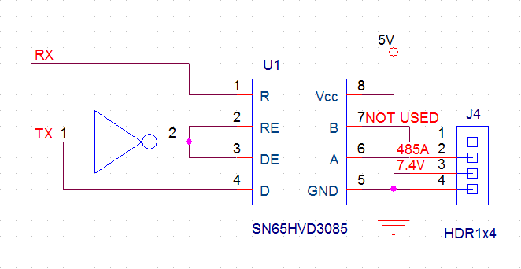

# A configuration tool for Futaba digital servo (RS303 & RS304).

---
__v1.0, 2016 July, 31st__  
## 1. Connect to one servo at a time.
Connecting multiple servos will cause problem when you use "Read Info" button.
## 2. Select with/without RPU module when establishing connection.
RPU module will add headers and footers to some command.
## 3. How to connect to a servo without using RPU module:
Check out the schematic below. RPU module uses TI's SN65HVD3085. I tried MAXIM MAX3485 but it didn't work. I guess it is because only A+ is used during communication. I used a USB->TTL convertor with an invertor to drive my TI chip (the same as RPU module). You can try your own design. Basically the lesson I learnt was:
* Set DE to high will overwrite RE. You need to set both RE and DE to low to enable receiving function.

